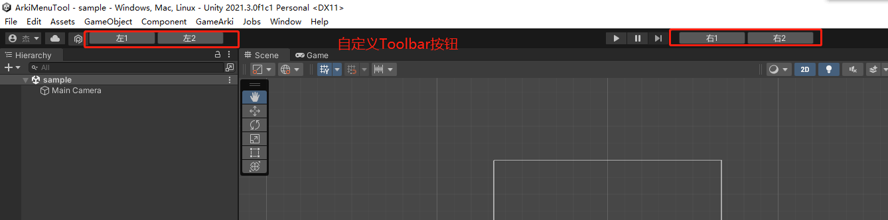

# ArkiMenuTool
🧾 Unity 菜单工具集(不支持Runtime)

## 功能
1. 重新生成 .csproj
2. 切割Sprite：将切割的 sprite(multiply模式) 每张图单独生成
3. ToolbarEditor: 自定义 Toolbar  


``` csharp
// 用法
// 1. 引入 GameArki.MenuTool.ToolbarEditor 程序集
// 2. 自创一个静态类
using UnityEngine;
using UnityEditor;

namespace GameArki.MenuTool.Sample {

    [InitializeOnLoad]
    public static class Sample_ToolbarEditor {

        static Sample_ToolbarEditor() {

            // 初始化
            ToolbarEditorCore.Initialize();

            // 注册左侧按钮
            ToolbarEditorCore.RegisterLeftGUIDraw(() => {
                bool has = GUILayout.Button("左1", GUILayout.Width(100));
                if (has) {
                    Debug.Log("左1");
                }

                has = GUILayout.Button("左2", GUILayout.Width(100));
                if (has) {
                    Debug.Log("左2");
                }
            });

            // 注册右侧按钮
            ToolbarEditorCore.RegisterRightGUIDraw(() => {
                bool has = GUILayout.Button("右1", GUILayout.Width(100));
                if (has) {
                    Debug.Log("右1");
                }

                has = GUILayout.Button("右2", GUILayout.Width(100));
                if (has) {
                    Debug.Log("右2");
                }
            });

        }

    }

}
```